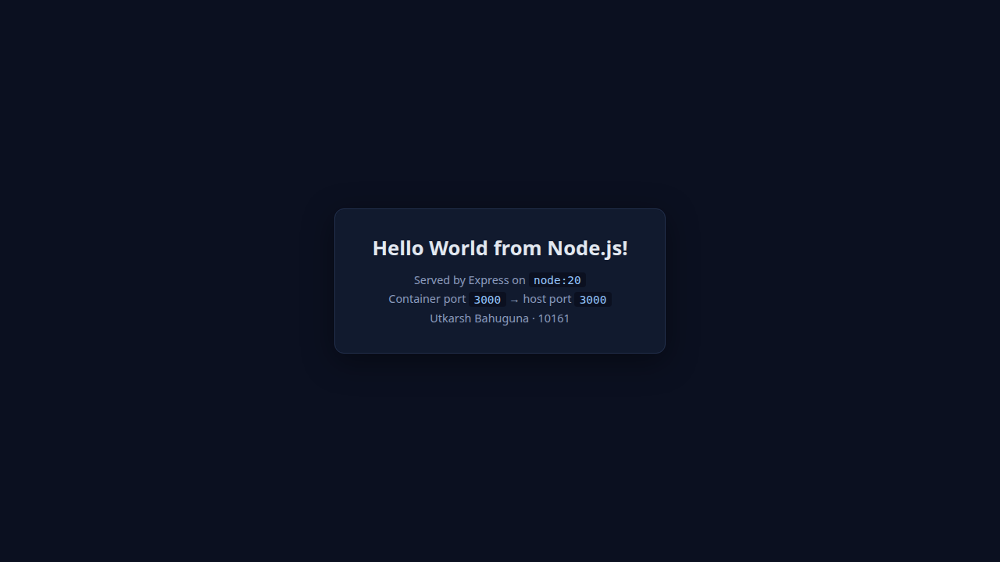
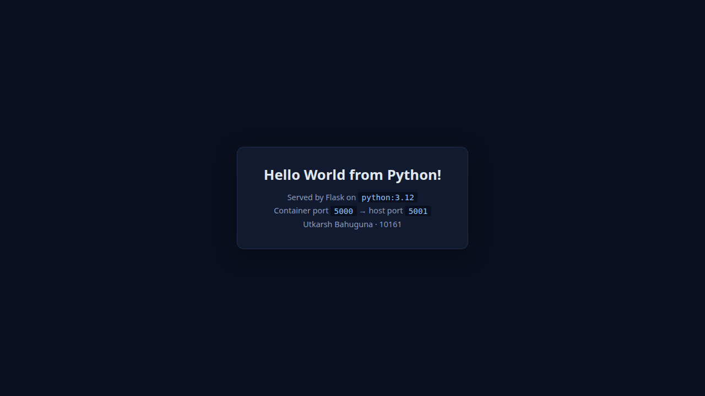
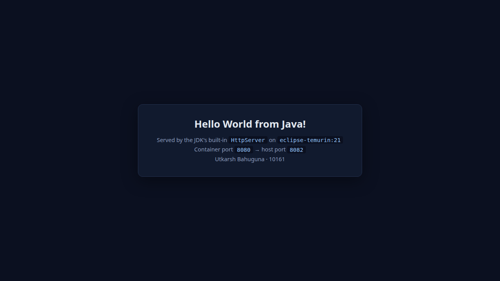
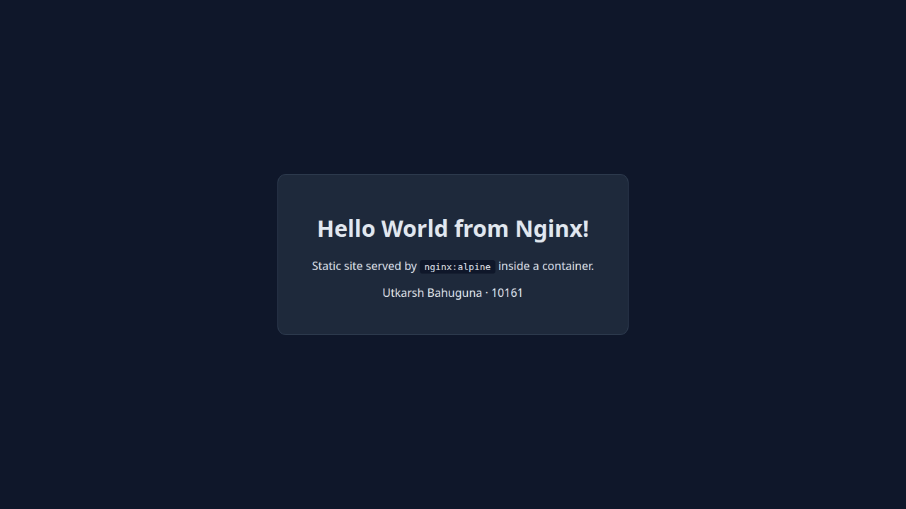
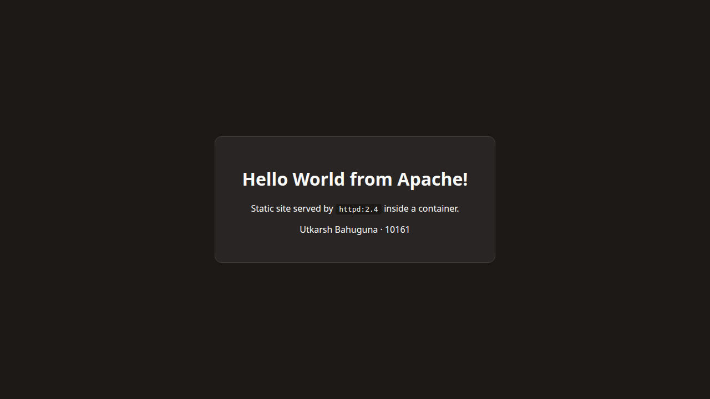
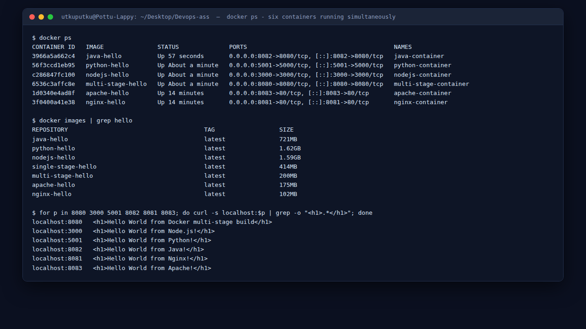

# Docker Fundamentals: Containerising Five Application Stacks

**Name:** Utkarsh Bahuguna &nbsp;&nbsp;**Enrollment Number:** 10161

Five "Hello World" applications, five different base images, all built and run **simultaneously** on one host. Each directory holds a `Dockerfile`, the application source, and a `script.sh` that builds and runs it.

| App | Base image | Host port | Container port | Image size |
|---|---|---|---|---|
| [`nodejs-app`](nodejs-app/) | `node:20` | 3000 | 3000 | 1.59 GB |
| [`python-app`](python-app/) | `python:3.12` | 5001 | 5000 | 1.62 GB |
| [`java-app`](java-app/) | `eclipse-temurin:21` | 8082 | 8080 | 721 MB |
| [`nginx-app`](nginx-app/) | `nginx:alpine` | 8081 | 80 | 102 MB |
| [`apache-app`](apache-app/) | `httpd:2.4` | 8083 | 80 | 175 MB |

A sixth application - a **multi-stage** Node build on port 8080 - lives in [`../Docker%20Images/`](../Docker%20Images/).

---

## The two rules that make all of this work

**1. A server inside a container must bind `0.0.0.0`, not `127.0.0.1`.**
A container has its own network namespace, so `127.0.0.1` inside the container is the *container's* loopback. Docker's port forwarding delivers traffic to the container's external interface, so a process listening only on loopback is unreachable no matter what `-p` says. Every app here binds `0.0.0.0` explicitly.

**2. Only the host side of `-p <host>:<container>` has to be unique.**
Three of these apps listen on port 8080 or 80 *inside* their containers with no conflict at all, because each container has its own namespace. Only the left-hand number is a real host resource.

---

## Node.js: `node:20`

```dockerfile
FROM node:20
WORKDIR /app
COPY package*.json ./     # manifests first, so this layer caches
RUN npm install
COPY . .                  # then the source
EXPOSE 3000
CMD ["npm", "start"]
```

**Why `COPY package*.json` before `COPY . .`?** Docker caches each layer and invalidates everything after the first change. If the source were copied first, editing one line of `server.js` would bust the cache and re-run `npm install` on every build. Copying only the manifests first means `npm install` re-runs only when the dependencies actually change.

`EXPOSE` is documentation - it records the port the image intends to use. It does **not** publish anything; only `-p` does that.

```bash
docker build -t nodejs-hello .
docker run -d --name nodejs-container -p 3000:3000 nodejs-hello
```



---

## Python: `python:3.12`

```dockerfile
FROM python:3.12
WORKDIR /app
COPY requirements.txt ./
RUN pip install --no-cache-dir -r requirements.txt
COPY app.py ./
EXPOSE 5000
CMD ["python", "app.py"]
```

`--no-cache-dir` stops pip writing its download cache into the image - bytes that can never be useful at runtime.

```python
app.run(host="0.0.0.0", port=5000)   # 0.0.0.0 is mandatory, see rule 1 above
```

Mapped as `-p 5001:5000` - **port 5000 on the host is a common conflict** (macOS AirPlay Receiver claims it, and many local dev servers default to it), so the host side is shifted to 5001 while the application still listens on its natural port inside the container.

```bash
docker build -t python-hello .
docker run -d --name python-container -p 5001:5000 python-hello
```



---

## Java: `eclipse-temurin:21`

```dockerfile
FROM eclipse-temurin:21
WORKDIR /app
COPY HelloWorld.java ./
RUN javac HelloWorld.java
EXPOSE 8080
CMD ["java", "HelloWorld"]
```

Deliberately built with **no Maven or Gradle**, using only the JDK's built-in `com.sun.net.httpserver.HttpServer`. That keeps the Dockerfile honest about what a bare JDK image actually costs: 721 MB, because the full JDK - compiler, debugger, all of it - ships in the runtime image. Compiling in one stage and copying the `.class` files into a JRE image would cut that dramatically; that is exactly the technique demonstrated in [`../Docker%20Images/`](../Docker%20Images/).

Mapped as `-p 8082:8080` because host port 8080 is already taken by the multi-stage app.

```bash
docker build -t java-hello .
docker run -d --name java-container -p 8082:8080 java-hello
```



---

## Nginx: `nginx:alpine`

```dockerfile
FROM nginx:alpine
COPY index.html /usr/share/nginx/html/index.html
EXPOSE 80
```

Two lines of substance. `/usr/share/nginx/html` is nginx's default web root, so dropping a file there *is* the deployment.

**There is deliberately no `CMD`.** The base image already sets `CMD ["nginx", "-g", "daemon off;"]`, and the `daemon off` part is essential - nginx would otherwise fork into the background, the foreground process would exit, and Docker would consider the container finished. Inheriting a correct `CMD` is safer than rewriting it.

At 102 MB this is the smallest image here, because `alpine` is a ~5 MB base.

```bash
docker build -t nginx-hello .
docker run -d --name nginx-container -p 8081:80 nginx-hello
```



---

## Apache: `httpd:2.4`

```dockerfile
FROM httpd:2.4
COPY index.html /usr/local/apache2/htdocs/index.html
EXPOSE 80
```

Same idea as nginx, different document root: `/usr/local/apache2/htdocs`. Getting that path right is the whole task - `COPY` to the wrong directory produces a container that runs perfectly and serves the default "It works!" page instead of your site.

175 MB versus nginx's 102 MB: `httpd:2.4` is Debian-based rather than Alpine-based.

```bash
docker build -t apache-hello .
docker run -d --name apache-container -p 8083:80 apache-hello
```



---

## All six running at once



```
$ docker ps
CONTAINER ID   IMAGE               STATUS              PORTS                                         NAMES
3966a5a662c4   java-hello          Up 57 seconds       0.0.0.0:8082->8080/tcp, [::]:8082->8080/tcp   java-container
56f3ccd1eb95   python-hello        Up About a minute   0.0.0.0:5001->5000/tcp, [::]:5001->5000/tcp   python-container
c286847fc100   nodejs-hello        Up About a minute   0.0.0.0:3000->3000/tcp, [::]:3000->3000/tcp   nodejs-container
6536c3affc8e   multi-stage-hello   Up About a minute   0.0.0.0:8080->8080/tcp, [::]:8080->8080/tcp   multi-stage-container
1d0340e4ad8f   apache-hello        Up 14 minutes       0.0.0.0:8083->80/tcp, [::]:8083->80/tcp       apache-container
3f0400a41e38   nginx-hello         Up 14 minutes       0.0.0.0:8081->80/tcp, [::]:8081->80/tcp       nginx-container
```

Every one responding:

```
$ for p in 8080 3000 5001 8082 8081 8083; do curl -s localhost:$p | grep -o "<h1>.*</h1>"; done
localhost:8080   <h1>Hello World from Docker multi-stage build</h1>
localhost:3000   <h1>Hello World from Node.js!</h1>
localhost:5001   <h1>Hello World from Python!</h1>
localhost:8082   <h1>Hello World from Java!</h1>
localhost:8081   <h1>Hello World from Nginx!</h1>
localhost:8083   <h1>Hello World from Apache!</h1>
```

---

## Image sizes: and what explains them

```
$ docker images | grep hello
REPOSITORY           TAG      SIZE
python-hello         latest   1.62GB
nodejs-hello         latest   1.59GB
java-hello           latest   721MB
single-stage-hello   latest   414MB
multi-stage-hello    latest   200MB
apache-hello         latest   175MB
nginx-hello          latest   102MB
```

**A 16x spread between the largest and smallest, for applications that all print one line of text.** The size is almost entirely the base image, not the code:

- `python:3.12` and `node:20` are full Debian systems with the complete toolchain - compilers, headers, package managers. Handy for building, dead weight at runtime.
- `eclipse-temurin:21` ships the whole JDK when only a JRE is needed to run.
- `nginx:alpine` is Alpine + nginx, and Alpine's base is about 5 MB.

The lesson: **choose the smallest base that can still run your app, and do the building somewhere else.** That is exactly what the multi-stage build in [`../Docker%20Images/`](../Docker%20Images/) does - 200 MB for the same Node.js application that costs 1.59 GB here, an **8x reduction**.

---

## Port conflicts encountered

| Conflict | Resolution |
|---|---|
| Host 8080 claimed by the multi-stage container | Java published on `-p 8082:8080` |
| Host 5000 is a well-known conflict (AirPlay, dev servers) | Python published on `-p 5001:5000` |
| Both nginx and apache listen on container port 80 | Published on hosts 8081 and 8083 - no conflict, separate namespaces |

No application code or internal port changed. Only the host-side number moved.

---

## Cleanup

```bash
docker rm -f nodejs-container python-container java-container nginx-container apache-container
docker rmi nodejs-hello python-hello java-hello nginx-hello apache-hello
```

Full log: [`outputs/docker-run-all.txt`](outputs/docker-run-all.txt)

---

**Previous:** [Network Fundamentals](../Networking/README.md) · **Next:** [Dockerfiles & Images](../Docker%20Images/README.md) · [Back to index](../README.md)

*Utkarsh Bahuguna · 10161*
