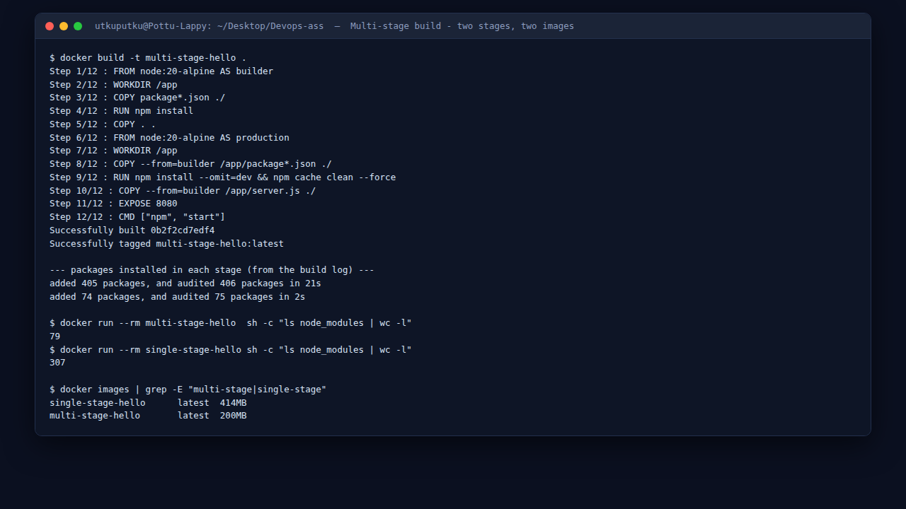
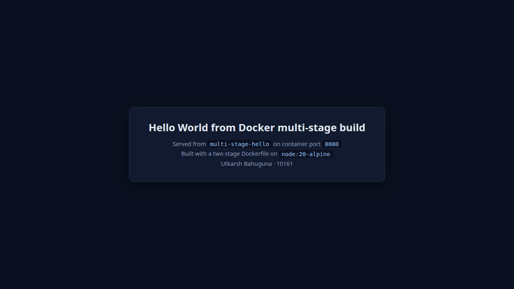

# Docker Multi-Stage Build Assignment

**Name:** Utkarsh Bahuguna &nbsp;&nbsp;**Enrollment Number:** 10161

---

## Task 1: Multi-Stage Dockerfile

### What a multi-stage build is

A multi-stage Dockerfile has **more than one `FROM`**. Each `FROM` starts a fresh stage with a clean filesystem. The final image is built from the **last stage only** - everything in the earlier stages is discarded unless you explicitly `COPY --from=<stage>` it forward.

That solves a real tension. Building an application needs compilers, dev dependencies, test runners and caches. Running it needs almost none of that. Without multi-stage builds you either ship all the build tooling to production or maintain two separate Dockerfiles that inevitably drift apart.

To make the effect measurable, this app declares **real dev dependencies** (`eslint`, `jest`) alongside `express`:

```json
"dependencies":    { "express": "^4.19.2" },
"devDependencies": { "eslint": "^8.57.0", "jest": "^29.7.0" }
```

### `Dockerfile`

```dockerfile
# ==========================================================
# Stage 1: builder
# Installs EVERY dependency (production + dev) and brings in
# the full source tree. Nothing here survives into the final
# image unless it is explicitly copied.
# ==========================================================
FROM node:20-alpine AS builder

WORKDIR /app

COPY package*.json ./
RUN npm install          # 405 packages: express + eslint + jest

COPY . .

# ==========================================================
# Stage 2: production
# Starts again from a clean base and copies ONLY what is
# needed to run.
# ==========================================================
FROM node:20-alpine AS production

WORKDIR /app

COPY --from=builder /app/package*.json ./

RUN npm install --omit=dev && npm cache clean --force   # 74 packages

COPY --from=builder /app/server.js ./

EXPOSE 8080
CMD ["npm", "start"]
```

### Build and run

```bash
docker build -t multi-stage-hello .
docker run -d --name multi-stage-container -p 8080:8080 multi-stage-hello
docker ps
curl http://localhost:8080
```

### The build log proves both stages ran

```
$ docker build -t multi-stage-hello .
Step 1/12 : FROM node:20-alpine AS builder
Step 2/12 : WORKDIR /app
Step 3/12 : COPY package*.json ./
Step 4/12 : RUN npm install
added 405 packages, and audited 406 packages in 21s
Step 5/12 : COPY . .
Step 6/12 : FROM node:20-alpine AS production          <-- SECOND STAGE STARTS HERE
Step 7/12 : WORKDIR /app
Step 8/12 : COPY --from=builder /app/package*.json ./
Step 9/12 : RUN npm install --omit=dev && npm cache clean --force
added 74 packages, and audited 75 packages in 2s
Step 10/12 : COPY --from=builder /app/server.js ./
Step 11/12 : EXPOSE 8080
Step 12/12 : CMD ["npm", "start"]
Successfully built 0b2f2cd7edf4
Successfully tagged multi-stage-hello:latest
```



**Step 6 is the whole point.** A second `FROM` on the same base image starts a brand-new filesystem. The 405 packages installed at step 4 exist only in the builder stage; step 9 installs 74 into the clean stage. `COPY --from=builder` at steps 8 and 10 is the only bridge between them.

> **Note on the builder used.** Docker Buildx is not installed on this machine, so the build ran on Docker's legacy builder, which labels output `Step N/12` rather than BuildKit's `[builder 4/5]` / `[production 4/5]` form. The multi-stage semantics are identical - the `FROM ... AS production` at step 6 is the stage boundary.

### Application output

```bash
$ curl -s http://localhost:8080 | grep -o "<h1>.*</h1>"
<h1>Hello World from Docker multi-stage build</h1>

$ curl -s http://localhost:8080/health
{"status":"ok","build":"multi-stage","node":"v20.20.2"}
```

Verified: the application displays **Hello World from Docker multi-stage build** on **port 8080**.

---

## Task 2: Documentation

**Name:** Utkarsh Bahuguna &nbsp;&nbsp;**Enrollment Number:** 10161

### Application running successfully



Browser at `localhost:8080` displaying *Hello World from Docker multi-stage build*.

### `docker ps` showing the container on port 8080


```
CONTAINER ID   IMAGE               STATUS              PORTS                                         NAMES
6536c3affc8e   multi-stage-hello   Up About a minute   0.0.0.0:8080->8080/tcp, [::]:8080->8080/tcp   multi-stage-container
```

The `PORTS` column reads `0.0.0.0:8080->8080/tcp`, confirming the app is published on **port 8080**.

---

## Task 3: Proving the multi-stage build actually helps

Claiming a multi-stage build is smaller means nothing without a control. So the identical application was also built **single-stage**, from the **same `node:20-alpine` base**, using [`Dockerfile.single-stage`](Dockerfile.single-stage):

```dockerfile
FROM node:20-alpine
WORKDIR /app
COPY package*.json ./
RUN npm install          # dev dependencies included, cache kept
COPY . .                 # entire build context copied in
EXPOSE 8080
CMD ["npm", "start"]
```

### The measurement

```
$ docker images | grep -E "multi-stage|single-stage"
single-stage-hello   latest   414MB
multi-stage-hello    latest   200MB
```

**414 MB → 200 MB. A 2.07x reduction with the same base image, the same application and the same Node version.** The only variable is the second stage.

### Where the 214 MB went

```
$ docker run --rm multi-stage-hello  sh -c "ls node_modules | wc -l"
79
$ docker run --rm single-stage-hello sh -c "ls node_modules | wc -l"
307
```

```
$ docker run --rm multi-stage-hello sh -c "ls"
node_modules
package-lock.json
package.json
server.js

$ docker run --rm single-stage-hello sh -c "ls"
Dockerfile
Dockerfile.single-stage
node_modules
package-lock.json
script.sh
server.js
```

Two distinct problems in the single-stage image:

1. **228 extra `node_modules` directories** - eslint, jest and their transitive dependencies, none of which can run anything in production.
2. **Build files shipped to production** - `Dockerfile`, `Dockerfile.single-stage` and `script.sh` are all inside the running image. `COPY . .` copied the entire build context. The multi-stage image contains exactly four entries because `COPY --from=builder /app/server.js ./` names precisely one file.

That second point is a **security** argument as much as a size one. Every file in the image is a file an attacker who reaches the container can read.

### Against the plain `node:20` build

The same application built on the full `node:20` base lives in [`../Docker%20Fundamentals/nodejs-app/`](../Docker%20Fundamentals/nodejs-app/):

```
nodejs-hello        latest   1.59GB     <- node:20, single stage
single-stage-hello  latest   414MB      <- node:20-alpine, single stage
multi-stage-hello   latest   200MB      <- node:20-alpine, multi-stage
```

The two techniques are independent and multiply:

| Change | Saving |
|---|---|
| `node:20` → `node:20-alpine` | 1.59 GB → 414 MB (**3.8x**) |
| single-stage → multi-stage | 414 MB → 200 MB (**2.07x**) |
| **Both together** | 1.59 GB → 200 MB (**8x**) |

### Why this matters in practice

- **Deployment speed** - every pull, on every node, every deploy and rollback moves 8x less data.
- **Attack surface** - no compilers, no `npm` dev tooling, no source history in a production container. A CVE in `eslint` cannot affect an image that does not contain it.
- **Registry cost** - storage and egress scale with image size across every tag you keep.

---

## All four stacks running together

Task 3 of the wider assignment also required several stacks running at once. Six containers, six ports:

```
$ docker ps
CONTAINER ID   IMAGE               STATUS              PORTS                                         NAMES
3966a5a662c4   java-hello          Up 57 seconds       0.0.0.0:8082->8080/tcp, [::]:8082->8080/tcp   java-container
56f3ccd1eb95   python-hello        Up About a minute   0.0.0.0:5001->5000/tcp, [::]:5001->5000/tcp   python-container
c286847fc100   nodejs-hello        Up About a minute   0.0.0.0:3000->3000/tcp, [::]:3000->3000/tcp   nodejs-container
6536c3affc8e   multi-stage-hello   Up About a minute   0.0.0.0:8080->8080/tcp, [::]:8080->8080/tcp   multi-stage-container
1d0340e4ad8f   apache-hello        Up 14 minutes       0.0.0.0:8083->80/tcp, [::]:8083->80/tcp       apache-container
3f0400a41e38   nginx-hello         Up 14 minutes       0.0.0.0:8081->80/tcp, [::]:8081->80/tcp       nginx-container
```

```
multi-stage (8080): <h1>Hello World from Docker multi-stage build</h1>
node.js     (3000): <h1>Hello World from Node.js!</h1>
python      (5001): <h1>Hello World from Python!</h1>
java        (8082): <h1>Hello World from Java!</h1>
nginx       (8081): <h1>Hello World from Nginx!</h1>
apache      (8083): <h1>Hello World from Apache!</h1>
```

Sources for the other five are in [`../Docker%20Fundamentals/`](../Docker%20Fundamentals/), which also documents the port-conflict resolutions.

---

## `.dockerignore`

```
node_modules
npm-debug.log
.git
.gitignore
README.md
```

Excluding `node_modules` is not just tidiness. Without it, `COPY . .` would copy the **host's** `node_modules` - built against the host's OS and CPU architecture - over the top of the ones installed inside the image, which is a classic source of "works on my machine, segfaults in the container" native-module failures.

---

## Cleanup

```bash
docker rm -f multi-stage-container
docker rmi multi-stage-hello single-stage-hello
```

Full log: [`outputs/docker-builds.txt`](outputs/docker-builds.txt)

---

**Previous:** [Docker Fundamentals](../Docker%20Fundamentals/README.md) · **Next:** [Docker Networking & Volumes](../Docker%20Networking/README.md) · [Back to index](../README.md)

*Utkarsh Bahuguna · 10161*
