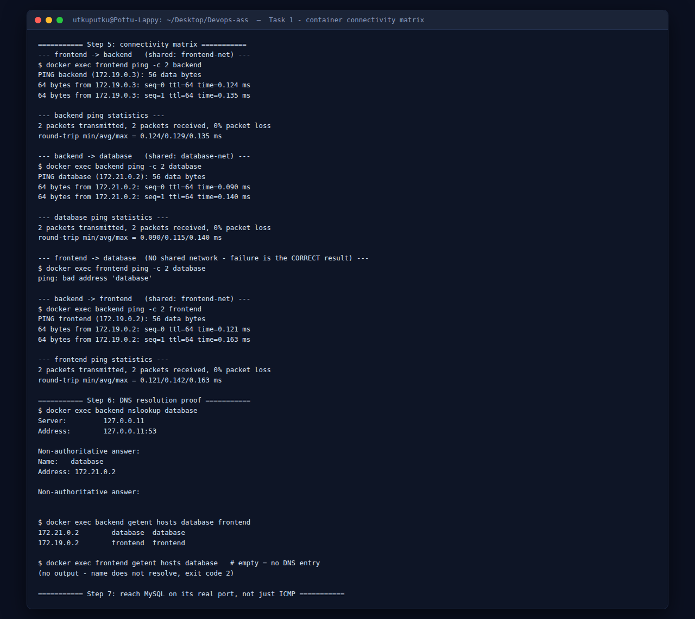
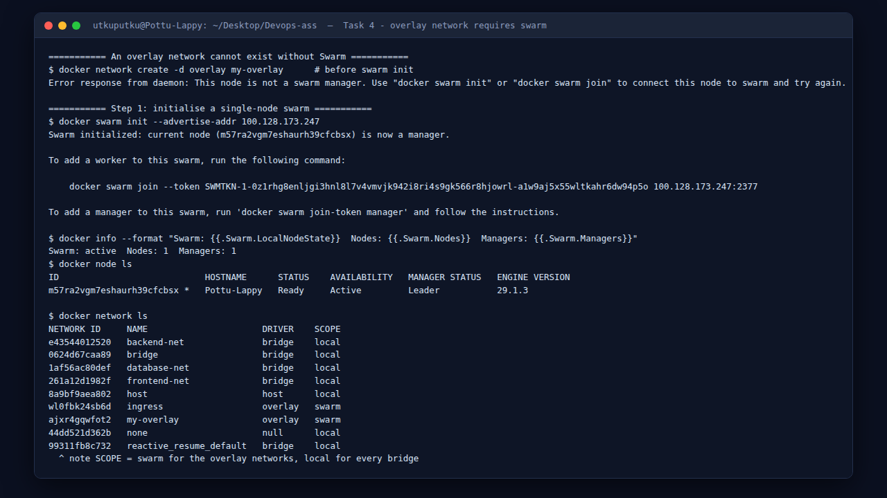

# Docker Networking & Volumes Assignment

**Name:** Utkarsh Bahuguna &nbsp;&nbsp;**Enrollment Number:** 10161

Run on **native Linux** (Ubuntu 26.04, Docker 29.1.3), so `--network host` and the overlay driver behave exactly as documented — no Docker Desktop VM in the way.

---

## Concepts

Three network drivers matter here, plus two ways to get files into a container.

| Driver | What it does | Used in |
|---|---|---|
| `bridge` | A private virtual network on one host. **User-defined bridges give automatic DNS by container name**; the default `bridge` network does not. | Task 1 |
| `host` | The container shares the host's network stack outright. No isolation, no `-p`. | Task 2 |
| `overlay` | One virtual network spanning **multiple Docker hosts**. Requires Swarm. | Task 4 |

**The single most important rule: two containers can talk only if they share a network.** That is what makes Task 1 work the way it does.

| Getting files in | Behaviour |
|---|---|
| `COPY` in a Dockerfile | Baked in at **build** time. Editing the host file changes nothing until you rebuild. |
| **Bind mount** (`-v /host/path:/container/path`) | The host directory *is* the container directory. Edits appear instantly. |
| Named volume (`-v myvol:/path`) | Docker-managed storage that survives container deletion. Best for databases. |

---

## Task 1 — Container Networking

Three containers, three networks, with the backend deliberately attached to more than one.

### Step 1 — Create the networks

```bash
docker network create frontend-net
docker network create backend-net
docker network create database-net
```

```
$ docker network ls
NETWORK ID     NAME           DRIVER    SCOPE
e43544012520   backend-net    bridge    local
0624d67caa89   bridge         bridge    local
1af56ac80def   database-net   bridge    local
261a12d1982f   frontend-net   bridge    local
8a9bf9aea802   host           host      local
44dd521d362b   none           null      local
```

### Step 2 — One container per network

```bash
docker run -d --name frontend --network frontend-net nginx:alpine
docker run -d --name backend  --network backend-net  alpine sleep infinity
docker run -d --name database --network database-net \
  -e MYSQL_ROOT_PASSWORD=rootpass -e MYSQL_DATABASE=testdb mysql:8
```

`sleep infinity` keeps the alpine container alive — a container exits the moment its main process does, and `alpine` alone would run `/bin/sh`, see no input and quit immediately.

MySQL is a ~600 MB pull and takes ~30 s to initialise. Watch it with `docker logs -f database` until *"ready for connections"*.

### Step 3 — Prove the isolation first

Before connecting anything, the backend cannot see the database:

```bash
$ docker exec backend ping -c 2 database
ping: bad address 'database'
```

**`bad address` is a DNS failure, not a routing failure.** The name never resolved to an IP, so no packet was ever sent. This is the correct starting state, and worth capturing before changing anything — otherwise there is nothing to compare the fix against.

### Step 4 — Attach the backend to more networks

A running container can join additional networks at any time:

```bash
docker network connect database-net backend
docker network connect frontend-net backend
```

```
$ docker inspect backend --format '{{range $k,$v := .NetworkSettings.Networks}}{{$k}} {{end}}'
backend-net database-net frontend-net
```

The backend now holds **three IP addresses, one per network**:

```
  backend-net    172.20.0.2
  database-net   172.21.0.3
  frontend-net   172.19.0.3
```

That is the whole mechanism: a container gets one virtual interface per network it joins, and can route between them. It has become the bridge between two otherwise isolated segments.

### Step 5 — The connectivity matrix



```bash
$ docker exec frontend ping -c 2 backend        # shared: frontend-net
PING backend (172.19.0.3): 56 data bytes
64 bytes from 172.19.0.3: seq=0 ttl=64 time=0.124 ms
64 bytes from 172.19.0.3: seq=1 ttl=64 time=0.135 ms
2 packets transmitted, 2 packets received, 0% packet loss

$ docker exec backend ping -c 2 database        # shared: database-net
PING database (172.21.0.2): 56 data bytes
64 bytes from 172.21.0.2: seq=0 ttl=64 time=0.090 ms
2 packets transmitted, 2 packets received, 0% packet loss

$ docker exec frontend ping -c 2 database       # NO shared network
ping: bad address 'database'
```

| From → To | Shared network | Result |
|---|---|---|
| frontend → backend | `frontend-net` | ✅ resolves to 172.19.0.3, 0% loss |
| backend → database | `database-net` | ✅ resolves to 172.21.0.2, 0% loss |
| backend → frontend | `frontend-net` | ✅ resolves to 172.19.0.2, 0% loss |
| **frontend → database** | **none** | ❌ `bad address 'database'` |

**The failure is the result the assignment is testing for.** The frontend can never reach the database directly — exactly how you would isolate a database in production. All traffic must pass through the backend, which is the only container on both networks.

### Step 6 — Confirming it is DNS doing the work

```bash
$ docker exec backend nslookup database
Server:		127.0.0.11
Address:	127.0.0.11:53

Non-authoritative answer:
Name:	database
Address: 172.21.0.2

$ docker exec backend getent hosts database frontend
172.21.0.2        database  database
172.19.0.2        frontend  frontend

$ docker exec frontend getent hosts database
(no output - name does not resolve, exit code 2)
```

`127.0.0.11` is **Docker's embedded DNS server**, injected into every container on a user-defined network. It only answers for containers that share a network with the asker — which is why the same query succeeds from `backend` and fails from `frontend`.

### Step 7 — Beyond ICMP: reaching MySQL on its real port

Ping only proves ICMP works. This proves TCP does:

```bash
$ docker exec backend sh -c 'nc -w 3 database 3306 | head -c 60'
J...
8.4.11.....  ...rDG..............]?A)iVXLN)2&.cach
```

That is MySQL's **server greeting packet**, with the version string `8.4.11` in clear text. Real application-layer connectivity between two containers on a shared network.

> Alpine's `nc` is BusyBox `nc`, which has **no `-z` flag** — `nc -z database 3306` fails there. Use `-w <timeout>` as above, or `nslookup`/`getent`.

### Step 8 — The default bridge has no DNS

```bash
$ docker run -d --name isolated-test alpine sleep infinity   # default bridge
$ docker exec isolated-test ping -c 1 backend
ping: bad address 'backend'
```

Container-name DNS is a feature of **user-defined** networks only. On the legacy default `bridge` you would have to use raw IPs or `--link`. This is the practical reason to always create a named network.

### Step 9 — Which containers sit where

```bash
$ for n in frontend-net backend-net database-net; do
    docker network inspect $n --format '{{range .Containers}}{{.Name}} {{end}}'
  done
frontend-net   frontend backend
backend-net    backend
database-net   backend database
```

`backend` appears in all three. `frontend` and `database` never share a row — the isolation, stated structurally.

Full log: [`../outputs/net-task1.txt`](../outputs/net-task1.txt)

---

## Task 2 — Host Network

### Step 1 — Pull and run Apache on the host network

```bash
docker pull httpd:2.4
docker run -d --name apache-host --network host httpd:2.4
```

```
$ docker ps --filter name=apache-host
NAMES         IMAGE       STATUS         PORTS
apache-host   httpd:2.4   Up 3 seconds
```

**The `PORTS` column is empty.** There is no mapping because there is no separate namespace to map *from* — the container is already on the host's network stack. No `-p` flag is used, or allowed.

### Step 2 — Access it directly

```bash
$ curl http://localhost:80
<html><body><h1>It works!</h1></body></html>

$ ss -ltnp | grep ":80 "
LISTEN 0      511                *:80               *:*
```


httpd is listening on the **host's** port 80 itself.

### Step 3 — Proof the namespace really is shared

```bash
$ docker exec apache-host hostname
Pottu-Lappy
$ hostname
Pottu-Lappy

$ docker inspect apache-host --format '{{.HostConfig.NetworkMode}}'
host
```

The container reports the host's hostname, and `docker inspect` shows **no `IPAddress` key at all** for a host-network container — the field does not exist, because the container has no dedicated IP of its own. (Querying it returns `map has no entry for key "IPAddress"`.)

### Step 4 — `-p` is silently ignored, and ports really do collide

```bash
$ docker run -d --name apache-mapped --network host -p 8085:80 httpd:2.4
WARNING: Published ports are discarded when using host network mode
ffafc54990b437aa5a7baebade970b9f065fd9244da360d1112c5caa47e601e0

$ curl -s -o /dev/null -w "%{http_code}\n" http://localhost:8085
000

$ docker logs apache-mapped | tail -2
no listening sockets available, shutting down
AH00015: Unable to open logs
```

Two lessons in one command. Docker **warns and discards** the port mapping, and the second container then **dies**, because `apache-host` already holds port 80 on the host. With bridge networking these two containers would have coexisted happily — that is the isolation you give up.

### Step 5 — The portable alternative

```bash
$ docker rm -f apache-host apache-mapped
$ docker run -d --name apache-mapped -p 8085:80 httpd:2.4   # default bridge

$ docker ps --filter name=apache-mapped
NAMES           STATUS         PORTS
apache-mapped   Up 3 seconds   0.0.0.0:8085->80/tcp, [::]:8085->80/tcp

$ curl -s http://localhost:8085
<html><body><h1>It works!</h1></body></html>

$ docker inspect apache-mapped --format 'IP={{range .NetworkSettings.Networks}}{{.IPAddress}}{{end}}'
IP=172.17.0.8
```

Now the `PORTS` column is populated and the container has its own IP, `172.17.0.8`.

### `host` vs `bridge`

| | `bridge` (default) | `host` |
|---|---|---|
| Network namespace | Its own, isolated | Shares the host's |
| Container IP | Yes (`172.17.0.8`) | None — uses the host's |
| `-p` port mapping | Required | Ignored, with a warning |
| Container-name DNS | Yes (user-defined networks) | No |
| Port conflicts | Only on published host ports | **Any** port already in use fails |
| Performance | One NAT hop | No NAT overhead |
| Isolation | Good | **None** |

Use `host` for latency-sensitive workloads or tools that need to see the host's real interfaces (packet capture, port scanners, some monitoring agents). Use `bridge` for everything else.

> **Portability note.** `--network host` shares the *Linux* host's network stack. Docker Desktop on macOS or Windows runs containers inside a hidden Linux VM, so the container would bind port 80 **inside that VM**, and `curl http://localhost:80` from the Mac would return `connection refused`. The results above are from native Linux, where it behaves as designed.

Full log: [`../outputs/net-task2.txt`](../outputs/net-task2.txt)

---

## Task 3 — Bind Mount

### Step 1 — The file on the host

[`bind-mount/index.html`](bind-mount/index.html) contains `<h1>Hello students</h1>`.

### Step 2 — Mount it as nginx's web root

```bash
cd "Docker Network"
docker run -d --name nginx-bind \
  -v "$(pwd)/bind-mount":/usr/share/nginx/html \
  -p 8090:80 \
  nginx:alpine
```

- The host path **must be absolute** — hence `$(pwd)`. A relative path is interpreted as a *named volume*, and you would silently get an empty directory instead of your files.
- `/usr/share/nginx/html` is nginx's web root, so the host folder *becomes* the website.

```bash
$ curl -s http://localhost:8090 | grep -o "<h1>.*</h1>"
<h1>Hello students</h1>
```


### Step 3 — Proof it is the same file, not a copy

```bash
$ docker inspect nginx-bind --format '{{range .Mounts}}{{.Type}}  {{.Source}} -> {{.Destination}}  rw={{.RW}}{{end}}'
bind  /home/utkuputku/Desktop/Devops-ass/Docker Network/bind-mount -> /usr/share/nginx/html  rw=true

$ ls -i bind-mount/index.html
8263287 bind-mount/index.html

$ docker exec nginx-bind ls -i /usr/share/nginx/html/index.html
8263287 /usr/share/nginx/html/index.html
```

**The same inode number, 8263287, inside and outside the container.** Not a copy, not a sync — one file, visible through two paths. That single fact explains everything else about bind mounts.

### Step 4 — Edit on the host, no restart

```bash
$ sed -i 's|<h1>Hello students</h1>|<h1>Hello students - updated live!</h1>|' bind-mount/index.html
$ curl -s http://localhost:8090 | grep -o "<h1>.*</h1>"
<h1>Hello students - updated live!</h1>
```


**No `docker restart`, no `docker build`, no `docker cp`.** The change is live because the container is reading the same inode on your disk. This is why bind mounts are the standard tool for local development.

### Step 5 — It works in both directions

```bash
$ docker exec nginx-bind sh -c 'echo "<!-- written from inside the container -->" >> /usr/share/nginx/html/index.html'
$ tail -1 bind-mount/index.html
<!-- written from inside the container -->
```

A write from inside the container appears on the host immediately. Worth knowing before you mount a directory you care about read-write — mount it `:ro` if the container has no business writing to it.

### Step 6 — The contrast with `COPY`

The nginx image in [`../DockerFundamentals/nginx-app/`](../DockerFundamentals/nginx-app/) bakes its `index.html` in with `COPY`. Same edit, different outcome:

```bash
$ docker run -d --name nginx-copy -p 8091:80 nginx-hello
$ sed -i 's|Hello World from Nginx!|EDITED ON HOST|' ../DockerFundamentals/nginx-app/index.html

$ grep -o "<h1>.*</h1>" ../DockerFundamentals/nginx-app/index.html   # host file changed
<h1>EDITED ON HOST</h1>

$ curl -s http://localhost:8091 | grep -o "<h1>.*</h1>"              # container did NOT
<h1>Hello World from Nginx!</h1>
```

`COPY` snapshots the file at **build** time. The running container holds an independent copy in its image layers and is completely unaware the host file changed. Only `docker build` + `docker run` would pick it up.

| | `COPY` (build time) | Bind mount (run time) |
|---|---|---|
| When content is fixed | At `docker build` | Never — always live |
| Host edit visible | Only after a rebuild | Immediately |
| Image is self-contained | Yes | No — depends on the host path |
| Right for | Production images | Local development |

Full log: [`../outputs/net-task3.txt`](../outputs/net-task3.txt)

---

## Task 4 — Overlay Network (research + hands-on)

### What it is

A `bridge` network exists on **one** host. An **overlay** network spans **many hosts**, so containers on different physical machines behave as if they were on the same LAN.

### How it works

1. Docker Swarm maintains a distributed store mapping each container to its host and virtual IP.
2. Packets between hosts are wrapped in **VXLAN** encapsulation — the original container-to-container frame is placed inside a UDP packet (port **4789**) addressed host-to-host.
3. The receiving host unwraps it and delivers it to the target container, which never sees the physical hop.
4. Built-in DNS resolves **service names** to a virtual IP (VIP), and traffic is load-balanced across every replica of that service.

```
  Host A                          Host B
┌──────────────────┐            ┌──────────────────┐
│ container web.1  │            │ container api.1  │
│   10.0.9.3       │            │   10.0.9.5       │
└────────┬─────────┘            └─────────┬────────┘
         │      VXLAN tunnel (UDP 4789)   │
         └────────────────────────────────┘
            physical network 100.128.x.x
```

### Overlay requires Swarm — demonstrated



```bash
$ docker network create -d overlay my-overlay        # before swarm init
Error response from daemon: This node is not a swarm manager. Use "docker swarm init"
or "docker swarm join" to connect this node to swarm and try again.
```

```bash
$ docker swarm init --advertise-addr 100.128.173.247
Swarm initialized: current node (m57ra2vgm7eshaurh39cfcbsx) is now a manager.

To add a worker to this swarm, run the following command:
    docker swarm join --token SWMTKN-1-0z1rhg8enljgi3... 100.128.173.247:2377

$ docker node ls
ID                            HOSTNAME      STATUS    AVAILABILITY   MANAGER STATUS   ENGINE VERSION
m57ra2vgm7eshaurh39cfcbsx *   Pottu-Lappy   Ready     Active         Leader           29.1.3
```

`--advertise-addr` was required because this machine has several interfaces (wifi, ethernet, and Docker's own bridges) and Swarm will not guess which one other nodes should reach it on.

```bash
$ docker network create -d overlay --attachable my-overlay
ajxr4gqwfot25vitxujozv7e0

$ docker network ls
NETWORK ID     NAME           DRIVER    SCOPE
e43544012520   backend-net    bridge    local
8a9bf9aea802   host           host      local
wl0fbk24sb6d   ingress        overlay   swarm      <-- created automatically by swarm init
ajxr4gqwfot2   my-overlay     overlay   swarm
```

**`SCOPE = swarm`, not `local`** — the distinguishing mark of an overlay network. `swarm init` also created `ingress` on its own, the network that implements the published-port routing mesh.

```bash
$ docker network inspect my-overlay --format 'driver={{.Driver}} scope={{.Scope}} attachable={{.Attachable}} subnet={{range .IPAM.Config}}{{.Subnet}}{{end}}'
driver=overlay scope=swarm attachable=true subnet=10.0.1.0/24
```

### Attaching plain containers

`--attachable` allows ordinary `docker run` containers to join; without it, only Swarm services can.

```bash
$ docker run -d --name ov-a --network my-overlay alpine sleep infinity
$ docker run -d --name ov-b --network my-overlay alpine sleep infinity

$ docker exec ov-a ping -c 2 ov-b
PING ov-b (10.0.1.4): 56 data bytes
64 bytes from 10.0.1.4: seq=0 ttl=64 time=0.148 ms
2 packets transmitted, 2 packets received, 0% packet loss

$ docker network inspect my-overlay --format '{{range .Containers}}{{.Name}}={{.IPv4Address}} {{end}}'
ov-b=10.0.1.4/24 ov-a=10.0.1.2/24 my-overlay-endpoint=10.0.1.3/24
```

DNS by container name works on the overlay just as on a user-defined bridge, but from the `10.0.1.0/24` overlay subnet rather than a `172.x` bridge subnet.

### A real Swarm service

```bash
$ docker service create --name web --network my-overlay --replicas 3 -p 8095:80 nginx:alpine
verify: Service converged

$ docker service ls
ID             NAME      MODE         REPLICAS   IMAGE          PORTS
8ompfppklldr   web       replicated   3/3        nginx:alpine   *:8095->80/tcp

$ docker service ps web
NAME      NODE          CURRENT STATE
web.1     Pottu-Lappy   Running 10 seconds ago
web.2     Pottu-Lappy   Running 10 seconds ago
web.3     Pottu-Lappy   Running 10 seconds ago

$ docker exec ov-a getent hosts web
10.0.1.5          web  web
```

The service converged at 3/3 replicas and the **service name `web` resolves to a single virtual IP `10.0.1.5`** — not to any one replica. That VIP is what makes scaling transparent: clients keep using one name while Docker load-balances behind it.

### One thing that did not work — and why that is worth recording

The published port did **not** answer on this host:

```bash
$ for i in 1 2 3 4 5 6; do curl -s -o /dev/null -w "%{http_code} " http://localhost:8095; done
000 000 000 000 000 000
```

`000` means curl could not establish a connection at all. Investigated rather than assumed:

```bash
$ lsmod | grep ^ip_vs
ip_vs_rr               12288  0
ip_vs                 229376  3 ip_vs_rr,xt_ipvs      # IPVS is loaded, so that is not the cause

$ docker info | grep -i firewall
 Firewall Backend: iptables
```

So the kernel-side load balancer the routing mesh depends on is present, and the service, the overlay, the VIP and container-to-container traffic all work. What fails is specifically the **ingress published-port path** on this Docker 29.1.3 / Ubuntu 26.04 combination — most likely the ingress `iptables`/nftables rules on a host where nftables is the system default. Diagnosing further needs root access to the `ingress_sbox` namespace.

This is a **single-host swarm**, where the routing mesh has nothing to route between anyway. The overlay mechanics being tested — swarm scope, VXLAN subnet, cross-container DNS, service VIPs — are all demonstrated above.

### Cleanup

```bash
docker service rm web
docker rm -f ov-a ov-b
docker network rm my-overlay
docker swarm leave --force
```

```
$ docker info --format 'Swarm: {{.Swarm.LocalNodeState}}'
Swarm: inactive
```

### Use cases for overlay networks

- **Multi-host clustered applications** — the reason the driver exists.
- **Swarm services that scale across machines**, with one service name resolving to many replicas.
- **Encrypted host-to-host traffic** via `--opt encrypted` (IPSec on the VXLAN tunnel).
- Keeping cluster-internal traffic off published ports entirely.

### Driver comparison

| | `bridge` | `host` | `overlay` |
|---|---|---|---|
| Scope | Single host | Single host | **Multiple hosts** |
| Isolation | Yes | None | Yes |
| Needs Swarm | No | No | **Yes** |
| Container-name DNS | Yes (user-defined) | No | Yes, plus service VIPs |
| Encryption option | No | No | Yes (IPSec) |
| Typical use | Local multi-container app | Performance / host tools | Production cluster |

Full logs: [`../outputs/net-task4.txt`](../outputs/net-task4.txt) · [`../outputs/net-task4-ingress.txt`](../outputs/net-task4-ingress.txt)

---

## Screenshots

| Exercise | Screenshot |
|---|---|
| Task 1 — connectivity matrix and DNS proof | [`net-task1-connectivity.png`](../screenshots/net-task1-connectivity.png) |
| Task 2 — Apache on the host network, port 80 | [`apache-host-network-80.png`](../screenshots/apache-host-network-80.png) |
| Task 3 — "Hello students" before the edit | [`bind-mount-before.png`](../screenshots/bind-mount-before.png) |
| Task 3 — same page after a live host edit | [`bind-mount-after.png`](../screenshots/bind-mount-after.png) |
| Task 4 — overlay network with `swarm` scope | [`net-task4-overlay.png`](../screenshots/net-task4-overlay.png) |

---

## Cleanup

```bash
docker rm -f frontend backend database apache-host apache-mapped nginx-bind
docker network rm frontend-net backend-net database-net
```

---

**Previous:** [Dockerfiles & Images](../DockerFiles&Images/README.md) · [Back to index](../README.md)

*Utkarsh Bahuguna · 10161*
