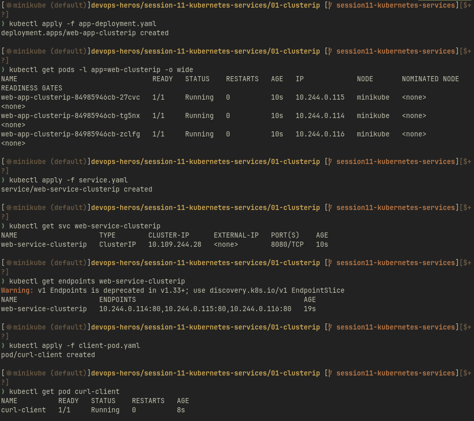
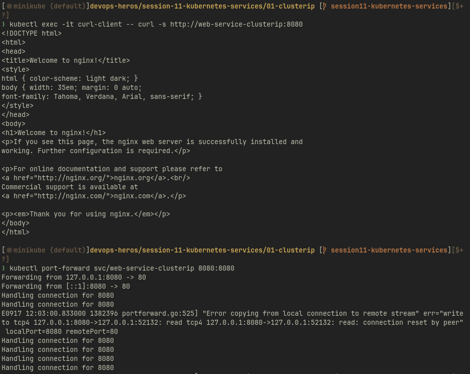
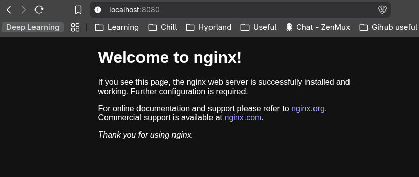
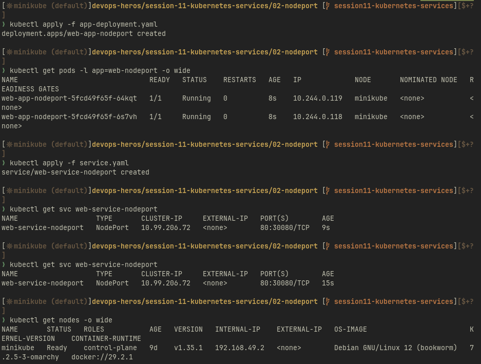
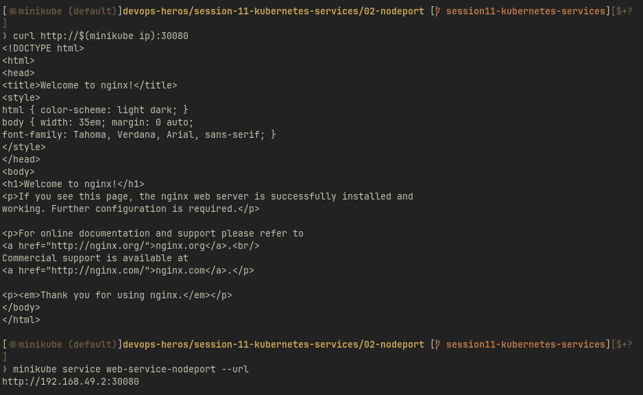
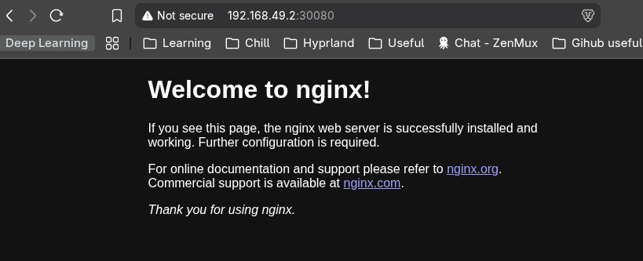
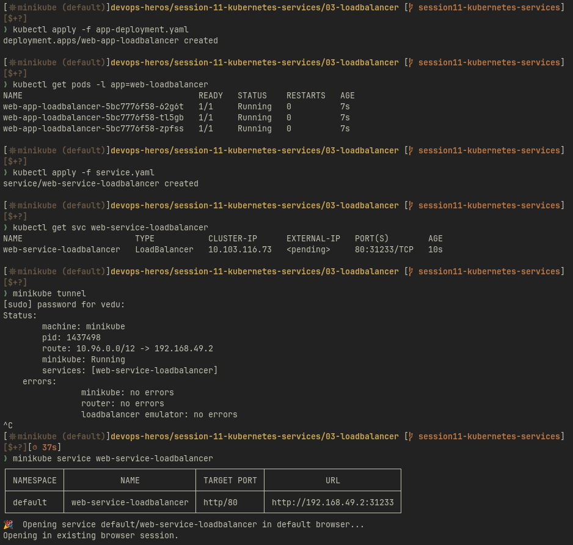
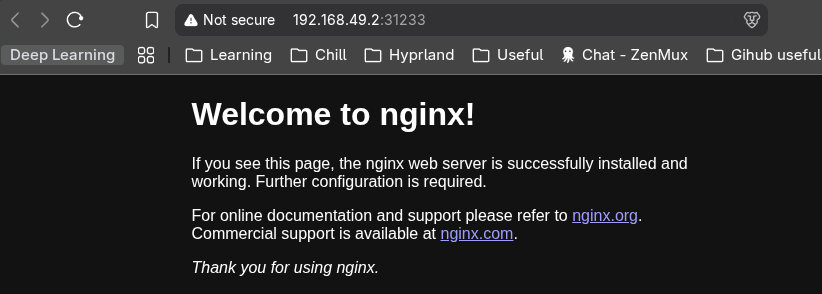
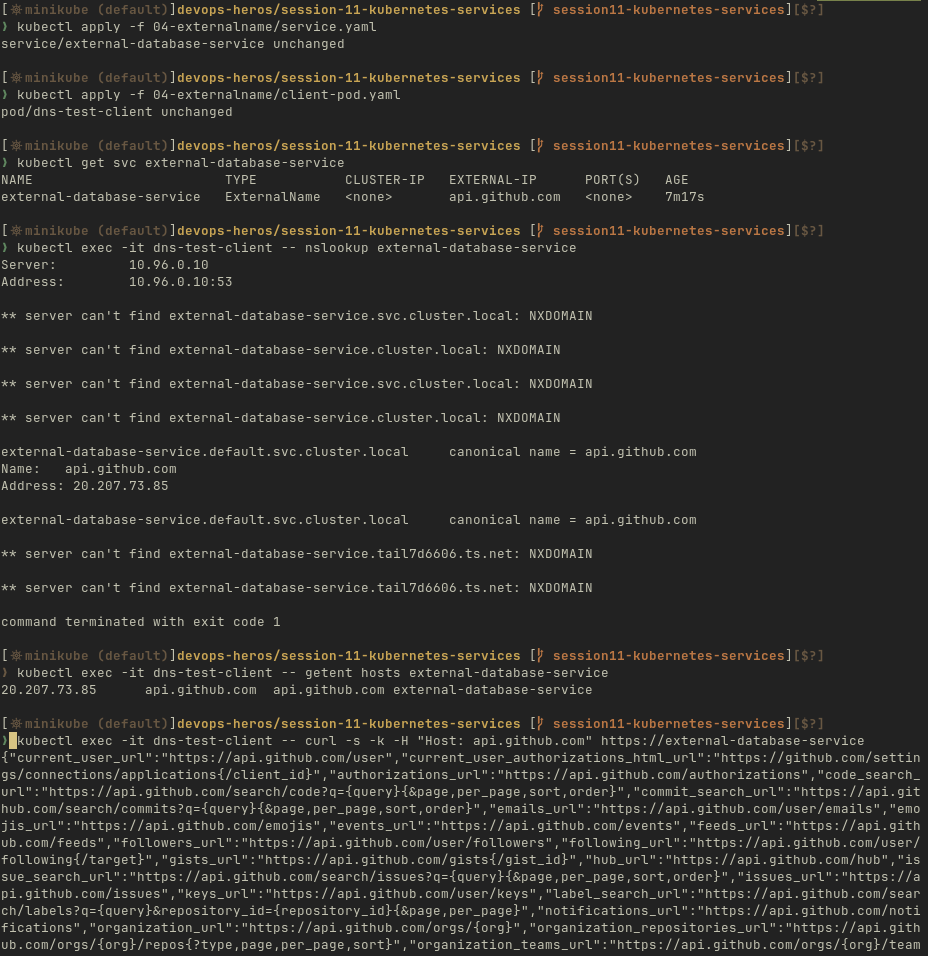
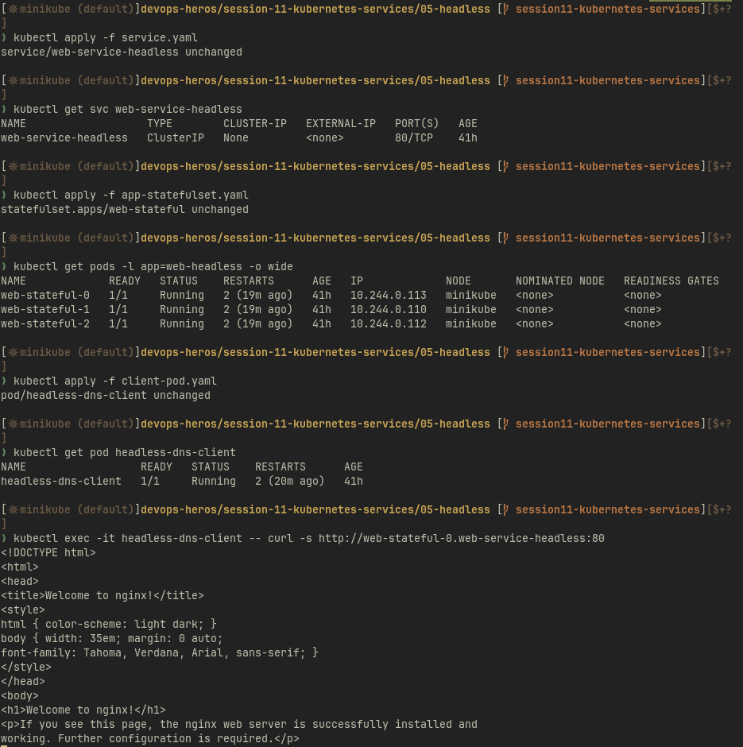

# Session 11 - Kubernetes Services

Evidence for all five Service types: **ClusterIP, NodePort, LoadBalancer, ExternalName and Headless**.

Every command and output below was transcribed from the captures in `screenshots/`. Nothing is
illustrative - where a command exited non-zero or printed a warning, it is recorded as it happened.

**Cluster:** minikube, node `192.168.49.2`, Kubernetes `v1.35.1`, runtime `docker://29.2.1`,
node OS Debian 12 (bookworm). Manifests were applied from per-demo directories
(`01-clusterip/`, `02-nodeport/`, `03-loadbalancer/`, `04-externalname/`, `05-headless/`), each
holding `app-deployment.yaml` (or `app-statefulset.yaml`), `service.yaml` and `client-pod.yaml`.

---

## 1. ClusterIP

**Objective:** A stable virtual IP reachable only from inside the cluster, load-balancing across the
pods matched by the Service selector.

### Screenshot 1

**Demonstrates:** Deployment and pods running, ClusterIP Service created, endpoints resolving to the
backend pod IPs, and the client pod created for internal testing - the full ClusterIP setup.
**Command:**
```bash
kubectl apply -f app-deployment.yaml
kubectl get pods -l app=web-clusterip -o wide
kubectl apply -f service.yaml
kubectl get svc web-service-clusterip
kubectl get endpoints web-service-clusterip
kubectl apply -f client-pod.yaml
kubectl get pod curl-client
```
**Evidence:**
- `deployment.apps/web-app-clusterip created`; three pods `1/1 Running` on node `minikube` with pod
  IPs `10.244.0.114`, `10.244.0.115`, `10.244.0.116`.
- `web-service-clusterip` is `TYPE ClusterIP`, `CLUSTER-IP 10.109.244.28`, `EXTERNAL-IP <none>`,
  `PORT(S) 8080/TCP` - no external address, which is the defining property of ClusterIP.
- `ENDPOINTS` lists `10.244.0.114:80,10.244.0.115:80,10.244.0.116:80` - exactly the three pod IPs
  above, proving the selector wired the Service to the real pods. Service port `8080` maps to
  container port `80`.
- `pod/curl-client created`, `1/1 Running`.

> `kubectl get endpoints` printed `Warning: v1 Endpoints is deprecated in v1.33+; use
> discovery.k8s.io/v1 EndpointSlice`. The command still works on v1.35.1; `kubectl get endpointslices`
> is the current equivalent.

**Screenshot:**



### Screenshot 2

**Demonstrates:** The Service answering from inside the cluster by DNS name, then `port-forward`
bridging it out to the host for browser verification.
**Command:**
```bash
kubectl exec -it curl-client -- curl -s http://web-service-clusterip:8080
kubectl port-forward svc/web-service-clusterip 8080:8080
```
**Evidence:** The curl returns the full nginx welcome page, resolved via the Service name from the
client pod. `port-forward` then reports `Forwarding from 127.0.0.1:8080 -> 80` and
`Forwarding from [::1]:8080 -> 80`, followed by repeated `Handling connection for 8080`.

> One `E0917 ... portforward.go:525 "Error copying from local connection to remote stream" ...
> read: connection reset by peer` line appears mid-log. This is the browser closing a keep-alive
> connection, not a Service fault - forwarding continues handling connections after it.

**Screenshot:**



### Screenshot 3

**Demonstrates:** Browser verification of the ClusterIP Service through the forwarded port.
**Command:** browser → `http://localhost:8080`
**Evidence:** The nginx welcome page renders with `localhost:8080` in the address bar. Note this
reaches the Service only because `port-forward` is running - the ClusterIP itself is not routable
from the host.
**Screenshot:**



---

## 2. NodePort

**Objective:** Expose the Deployment on a fixed port on the node itself, reachable from outside the
cluster without any forwarding.

### Screenshot 4

**Demonstrates:** Deployment and pods running, NodePort Service created showing `80:30080`, and the
minikube node details that supply the IP half of the address.
**Command:**
```bash
kubectl apply -f app-deployment.yaml
kubectl get pods -l app=web-nodeport -o wide
kubectl apply -f service.yaml
kubectl get svc web-service-nodeport
kubectl get nodes -o wide
```
**Evidence:**
- `deployment.apps/web-app-nodeport created`; two pods `1/1 Running` with IPs `10.244.0.118` and
  `10.244.0.119`.
- `web-service-nodeport` is `TYPE NodePort`, `CLUSTER-IP 10.99.206.72`, `EXTERNAL-IP <none>`,
  `PORT(S) 80:30080/TCP` - the `80:30080` mapping is the requested node port.
- The node `minikube` is `Ready`, role `control-plane`, age `9d`, `v1.35.1`, with
  `INTERNAL-IP 192.168.49.2`. That IP plus `30080` is the URL used next.

**Screenshot:**



### Screenshot 5

**Demonstrates:** curl through the NodePort from the host shell, outside the cluster.
**Command:**
```bash
curl http://$(minikube ip):30080
minikube service web-service-nodeport --url
```
**Evidence:** The nginx welcome page is returned directly to the host shell - no `port-forward` and
no client pod, which is the difference from ClusterIP. `minikube service --url` prints
`http://192.168.49.2:30080`, confirming the address independently.
**Screenshot:**



### Screenshot 6

**Demonstrates:** Browser verification of the NodePort Service.
**Command:** browser → `http://192.168.49.2:30080`
**Evidence:** The nginx welcome page renders with `192.168.49.2:30080` in the address bar - the node
IP directly, not `localhost`.
**Screenshot:**



---

## 3. LoadBalancer

**Objective:** Request an external address from the platform. minikube has no cloud load balancer, so
`minikube tunnel` acts as the emulator.

### Screenshot 7

**Demonstrates:** Deployment and pods running, LoadBalancer Service created, `minikube tunnel`
running as the LoadBalancer emulator, and `minikube service web-service-loadbalancer` opening it.
**Command:**
```bash
kubectl apply -f app-deployment.yaml
kubectl get pods -l app=web-loadbalancer
kubectl apply -f service.yaml
kubectl get svc web-service-loadbalancer
minikube tunnel
minikube service web-service-loadbalancer
```
**Evidence:**
- `deployment.apps/web-app-loadbalancer created`; three pods `1/1 Running`.
- `web-service-loadbalancer` is `TYPE LoadBalancer`, `CLUSTER-IP 10.103.116.73`,
  `EXTERNAL-IP <pending>`, `PORT(S) 80:31233/TCP`. A LoadBalancer Service is a NodePort Service plus
  an external address request - hence the `31233` node port alongside it.
- `minikube tunnel` reports `machine: minikube`, `pid: 1437498`,
  `route: 10.96.0.0/12 -> 192.168.49.2`, `services: [web-service-loadbalancer]` and
  `minikube: no errors / router: no errors / loadbalancer emulator: no errors`.
- `minikube service web-service-loadbalancer` prints the table
  `default | web-service-loadbalancer | http/80 | http://192.168.49.2:31233` and opens it in the
  browser.

> Honest note: `EXTERNAL-IP` still reads `<pending>` in this capture, and the tunnel is interrupted
> with `^C` before the final `minikube service` call. The URL that works is therefore the node IP
> plus node port `31233`, not a distinct load-balancer IP. To show `EXTERNAL-IP` populate, leave
> `minikube tunnel` running in a second terminal and re-run `kubectl get svc web-service-loadbalancer`
> while it is up.

**Screenshot:**



### Screenshot 8

**Demonstrates:** Browser verification of the LoadBalancer Service.
**Command:** browser → `http://192.168.49.2:31233`
**Evidence:** The nginx welcome page renders on port `31233` - a different port from the NodePort
capture in Screenshot 6, confirming this is the LoadBalancer Service and not the earlier one.
**Screenshot:**



---

## 4. ExternalName

**Objective:** A Service that proxies nothing and selects nothing - purely a CNAME record mapping an
in-cluster DNS name onto an external hostname.

### Screenshot 9

**Demonstrates:** The ExternalName Service pointing at `api.github.com`, DNS resolution from a client
pod, and a curl reaching the real GitHub API through the Service name.
**Command:**
```bash
kubectl apply -f 04-externalname/service.yaml
kubectl apply -f 04-externalname/client-pod.yaml
kubectl get svc external-database-service
kubectl exec -it dns-test-client -- nslookup external-database-service
kubectl exec -it dns-test-client -- getent hosts external-database-service
kubectl exec -it dns-test-client -- curl -s -k -H "Host: api.github.com" https://external-database-service
```
**Evidence:**
- `external-database-service` is `TYPE ExternalName`, `CLUSTER-IP <none>`,
  `EXTERNAL-IP api.github.com`, `PORT(S) <none>` - no cluster IP and no ports, unlike every Service
  above.
- `nslookup` against cluster DNS (`10.96.0.10`) returns
  `external-database-service.default.svc.cluster.local canonical name = api.github.com`, resolving to
  `20.207.73.85`. `getent hosts` confirms the same address.
- The curl returns GitHub's API root JSON (`current_user_url`, `authorizations_url`,
  `code_search_url`, …) - a real external response fetched via the in-cluster name.

> Two honest notes on this capture:
> - `nslookup` ends with `command terminated with exit code 1` despite succeeding. The resolver walks
>   the search list and the non-matching suffixes (`…svc.cluster.local`, `…cluster.local`,
>   `…tail7d6606.ts.net`) return `NXDOMAIN`, which sets the exit code. The authoritative answer is
>   present in the middle of the output. `getent hosts` was run as the clean confirmation.
> - `-k` and `-H "Host: api.github.com"` are required. The TLS certificate is issued for
>   `api.github.com`, but the URL requests `external-database-service`, so certificate verification
>   would otherwise fail. This is a genuine limitation of ExternalName in front of an HTTPS endpoint,
>   not a misconfiguration.

**Screenshot:**



---

## 5. Headless Service

**Objective:** `clusterIP: None` - no virtual IP and no load balancing. DNS hands back pod addresses
directly, and each StatefulSet pod gets a stable per-pod DNS name so a client can target one replica.

### Screenshot 10

**Demonstrates:** The Headless Service with `CLUSTER-IP None`, the StatefulSet pods running, the DNS
client pod, and a curl to one specific StatefulSet pod through the headless Service.
**Command:**
```bash
kubectl apply -f service.yaml
kubectl get svc web-service-headless
kubectl apply -f app-statefulset.yaml
kubectl get pods -l app=web-headless -o wide
kubectl apply -f client-pod.yaml
kubectl get pod headless-dns-client
kubectl exec -it headless-dns-client -- curl -s http://web-stateful-0.web-service-headless:80
```
**Evidence:**
- `web-service-headless` shows `CLUSTER-IP None` and `PORT(S) 80/TCP` - contrast directly with
  Screenshot 1, where a real virtual IP `10.109.244.28` was allocated.
- `statefulset.apps/web-stateful`; pods `web-stateful-0` (`10.244.0.113`), `web-stateful-1`
  (`10.244.0.110`) and `web-stateful-2` (`10.244.0.112`), all `1/1 Running`. The names are stable
  ordinals, not the random hash suffixes the Deployment pods carry in Screenshot 1.
- `headless-dns-client` is `1/1 Running`.
- `curl http://web-stateful-0.web-service-headless:80` returns the nginx welcome page from pod `-0`
  specifically - a per-pod DNS name that only exists because the Service is headless.

> The objects show `AGE 41h` and `RESTARTS 2 (19m ago)`; they were created in an earlier session and
> restarted when the cluster was resumed, so the applies report `unchanged` rather than `created`.

**Screenshot:**



---

## Coverage

| Demonstration | Required evidence | Captured |
|---|---|---|
| ClusterIP | Deployment/pods, Service, Endpoints, client pod | Screenshot 1 (+2, 3) |
| NodePort | Deployment/pods, Service, `80:30080`, node details, curl, browser | Screenshots 4, 5, 6 |
| LoadBalancer | Deployment/pods, Service, tunnel, `minikube service`, browser | Screenshots 7, 8 |
| ExternalName | Service → `api.github.com`, DNS lookup, curl | Screenshot 9 |
| Headless | `ClusterIP None`, StatefulSet pods, DNS/client pod, curl to one pod | Screenshot 10 |

**Not captured:** an `nslookup` of `web-service-headless` itself, which would return all three pod A
records rather than a single virtual IP. The per-pod curl in Screenshot 10 demonstrates the same
mechanism, but the multi-record lookup is the sharpest single illustration of headless DNS:

```bash
kubectl exec -it headless-dns-client -- nslookup web-service-headless
```
