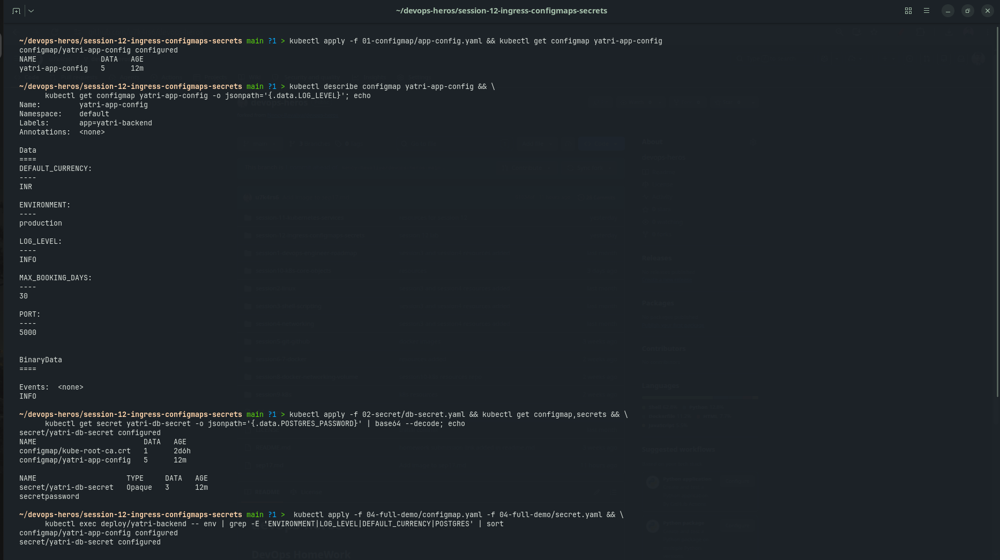
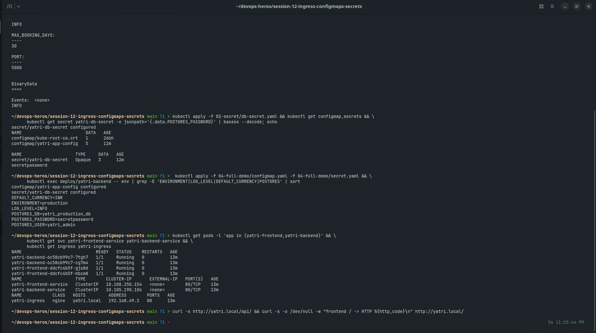

# Session 12 - Ingress, ConfigMaps & Secrets

Screenshots captured from the `session-12-ingress-configmaps-secrets` working directory against a
local minikube cluster (ingress address `192.168.49.2`, host `yatri.local`).

> Note: `secretpassword` below is a throwaway demo value used only for this assignment.

## Screenshots

### Screenshot 1 - Creating and inspecting the ConfigMap and Secret

- Description: Applies the standalone ConfigMap and Secret manifests, then inspects both -
  a full `describe` of the ConfigMap, a `jsonpath` read of a single key, and a `base64 --decode`
  of the Secret value to show that Secret data is encoded, not encrypted.
- Command/output demonstrated:
  - `kubectl apply -f 01-configmap/app-config.yaml && kubectl get configmap yatri-app-config`
    -> `yatri-app-config` with 5 keys
  - `kubectl describe configmap yatri-app-config` -> `DEFAULT_CURRENCY=INR`, `ENVIRONMENT=production`,
    `LOG_LEVEL=INFO`, `MAX_BOOKING_DAYS=30`, `PORT=5000`
  - `kubectl get configmap yatri-app-config -o jsonpath='{.data.LOG_LEVEL}'` -> `INFO`
  - `kubectl apply -f 02-secret/db-secret.yaml && kubectl get configmap,secrets`
    -> `secret/yatri-db-secret` (Opaque, 3 keys)
  - `kubectl get secret yatri-db-secret -o jsonpath='{.data.POSTGRES_PASSWORD}' | base64 --decode`
    -> `secretpassword`
- Screenshot:

### Screenshot 2 - Full demo: env injection, pods, services and Ingress

- Description: Applies the full-demo ConfigMap and Secret, confirms both are injected as environment
  variables inside the running backend pod, then lists the frontend/backend pods, their ClusterIP
  Services, and the Ingress routing `yatri.local` to them.
- Command/output demonstrated:
  - `kubectl apply -f 04-full-demo/configmap.yaml -f 04-full-demo/secret.yaml`
  - `kubectl exec deploy/yatri-backend -- env | grep -E 'ENVIRONMENT|LOG_LEVEL|DEFAULT_CURRENCY|POSTGRES' | sort`
    -> `DEFAULT_CURRENCY=INR`, `ENVIRONMENT=production`, `LOG_LEVEL=INFO`,
    `POSTGRES_DB=yatri_production_db`, `POSTGRES_PASSWORD=secretpassword`, `POSTGRES_USER=yatri_admin`
  - `kubectl get pods -l 'app in (yatri-frontend,yatri-backend)'`
    -> 2x `yatri-backend` and 2x `yatri-frontend` pods, all `1/1 Running`, 0 restarts
  - `kubectl get svc yatri-frontend-service yatri-backend-service`
    -> `yatri-frontend-service` ClusterIP `10.108.250.154:80`, `yatri-backend-service` ClusterIP `10.105.190.106:80`
  - `kubectl get ingress yatri-ingress`
    -> class `nginx`, host `yatri.local`, address `192.168.49.2`, port `80`
  - `curl -s http://yatri.local/api/` and `curl -s -o /dev/null -w "frontend / -> HTTP %{http_code}\n" http://yatri.local/`
    were run at the end of this capture; their output is below the visible frame.
- Screenshot:

